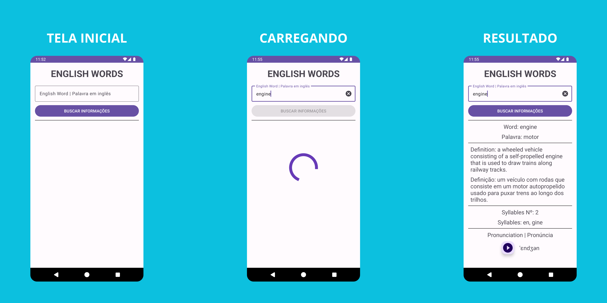

## 💻 Projeto

Words é um aplicativo para auxiliar com algumas palavras em inglês, mostrando sua definição e pronúncia para auxiliar no aprendizado. A busca das informações das palavras é feita atraves da [Words API](https://www.wordsapi.com/) e a tradução para Português foi realizada utilizando serviços do Google.

  

## 📺 Demonstração

Vídeo demonstrando o uso do app. Ative o áudio do vídeo para melhor experiencia!

  
https://github.com/WallaceMartinsTI/words/assets/58310961/4019d226-a683-430a-a645-de2be360fdd8

## 🛠️ Features

- Busca de informações de palavras em Inglês
- Tradução para Português da palavra e sua definição
- Áudio da palavra em inglês para ouvir a pronúncia
- Consumo de API com [Words API](https://www.wordsapi.com/)

## 📄 Licença

Esse projeto está sob a licença MIT. Veja o arquivo [license](./license) para mais detalhes.

 
